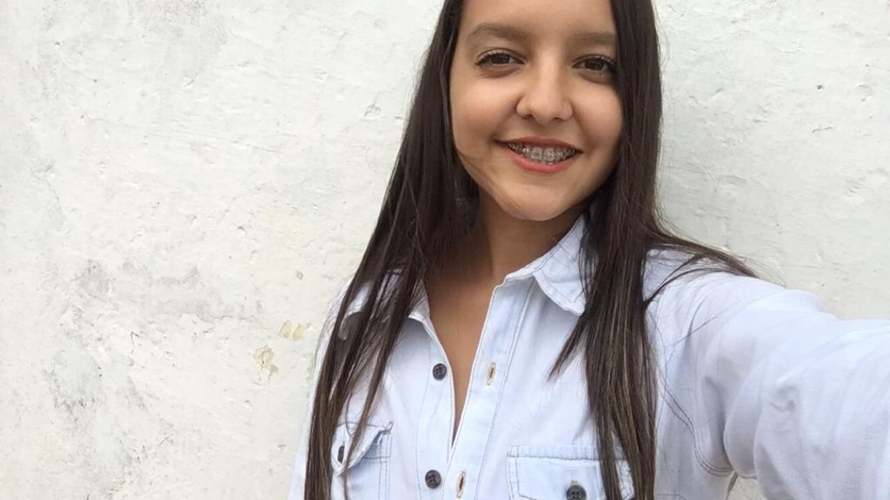
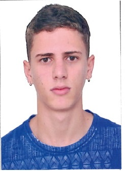

| .   |   .   |
|:--------|:---------------------------------------------------
|  | [Anderson Rodrigo da Silva](http://lattes.cnpq.br/3916683240962357) - Atual Coordenador do LEG (Portaria n. 02 de 8 de janeiro de 2018). Doutor em Estatística e Experimentação Agronômica (Esalq/USp). Bolsista Produtividade em Pesquisa CNPq nível 2. Principal projeto em desenvolvimento: _Padrões de respostas digitais multiespectrais de plantas daninhas à herbicidas paramanejo sítio-específico_ (Processo CNPq: 307334/2018-0). Página pessoal: [http://arsilva.weebly.com/](http://arsilva.weebly.com/). E-mail: anderson.silva@ifgoiano.edu.br |
|  | [Wilhan Valasco dos Santos](http://lattes.cnpq.br/9245323489075067) - Eng. Agrônomo. Mestrando em Proteção de Plantas. Projeto: _Desenvolvimento de aplicativo para análises de parâmetros da pulverização realizada sobre papéis hidrossensíveis por imagem RGB_. E-mail: wilhanvalasco@hotmail.com |
|  | [Rodrigo de Almeida Rocha](http://lattes.cnpq.br/5204482245975975) - Estudante de Agronomia. Bolsista IF Goiano de Iniciação Científica. Projeto: _Respostas de arroz à broca do colmo (Lepidoptera: Crambidae) por imagens infravermelho termais – parte II_. E-mail: rodrigota99@outlook.com |
|  | [Pedro Valasco dos Santos](http://lattes.cnpq.br/5560469164970345) - Estudante de Eng. Agrícola. Bolsista CNPq de Iniciação Tecnológica. Projeto: _Respostas termais e multiespectrais proximais de Bidens pilosa à atrazina – parte II_. E-mail: pedrovalasco@hotmail.com |
|  | [Mariana Santos da Silva](http://lattes.cnpq.br/8695678241979355) - Estudante de Agronomia. Voluntária de Iniciação Tecnológica. Projeto: _Automatização da análise da cinética de embebição de sementes de soja por visão computacional – parte II_. E-mail: marisantosdasilva13@gmail.com |
|  | [Ibsen Bezerra Borges](http://lattes.cnpq.br/3242283843533569) - Estudante de Eng. Agrícola. Voluntário de Iniciação Tecnológica. Projeto: _Sistema de baixo custo para monitoramento da umidade do solo para cultivo de hortaliças_. E-mail: iborges.engagricola@gmail.com |