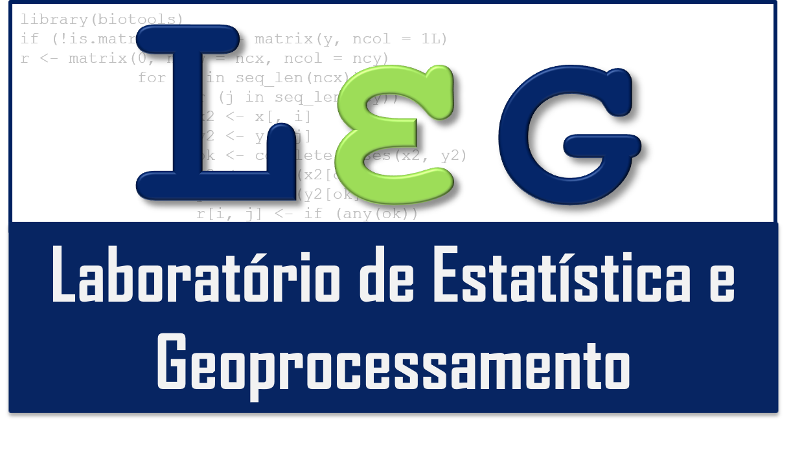

Seja muito bem-vindo! Vamos conhecer o LEG?

O LEG está no [Instituto Federal Goiano - Campus Urutaí](https://www.ifgoiano.edu.br/urutai).

## Objetivos

- Atendimento da demanda de aulas práticas de disciplinas de cursos técnicos, de graduação e de pós-graduação ofertados pelo IF Goiano – Campus Urutaí nas áreas de interesse: estatística aplicada, estatística computacional, fitopatometria, sensoriamento remoto, geoprocessamento, processamento de imagens.
- Desenvolver atividades de pesquisa nas áreas de interesse.
- Promover cursos de extensão e treinamentos. Estes cursos deverão ser devidamente registrados junto à Diretoria de Extensão do Campus Urutaí.
- Prestar assessoria e consultoria em estatística aplicada e agrometria à pesquisadores do IF Goiano e de outras instituições, principalmente em planejamento de experimentos e análise de dados.
- A comunidade será atendida conforme a disponibilidade dos participantes do LEG, perante agendamento.
- Gerar, adequar e atualizar bases de dados gráficas e não gráficas georreferenciadas para análises espaciais. 

## Normas de uso

O uso do LEG segue a seguinte ordem de prioridade:

- Disciplinas regulares de estatística, geoprocessamento, informática ou áreas de interesse e afins ofertadas à cursos de nível médio, graduação e pós-graduação, cuja demanda por aulas práticas requer uso frequente, constante no plano de ensino.
- Disciplinas de estatística, geoprocessamento, informática ou áreas de interesse e afins que requerem o uso esporádico, constante no plano de ensino.
- Cursos de formação complementar que requerem uso de software, devidamente registrados na DIREX do Campus Urutaí.
- Atividades relacionadas a projetos de pesquisa, constantes no cronograma do projeto.
- As solicitações de uso devem ser encaminhadas por meio de ofício ao coordenador do LEG, via SUAP, com antecedência mínima de uma semana.
- A instalação de programas executáveis é feita unicamente pela TI do Campus, mediante solicitação feita pelo usuário ao coordenador do LEG.
- A lotação do laboratório não deve exceder 20 pessoas.
- Recomenda-se o uso do ar-condicionado apenas em dias quentes e após as 9:00 da manhã.
- Ao fim de cada seção/aula, os computadores devem ser desligados, assim como os estabilizadores.
- O LEG não se responsabiliza por danos causados à dispositivos móveis conectados aos computadores, seja de ordem eletrônica ou digital.

## Infraestrutura e recursos

Espaço e instalações físicas: O laboratório possui um espaço físico de 42 m2, abrigando bancadas de trabalho e 20 computadores, nos quais estão instalados os softwares usados em ensino e pesquisa, sendo os principais: Microsoft R Open, R Studio, Python 3.8, ImageJ Idrisisi, ArcView, Spring, ArcGis, QGIS, Autocad, DataGeosis, Topograph, Sketch Up, Geogebra.

Principais equipamentos: 20 microcomputadores, 03 estações total, 04 aparelhos receptores de GPS Triton 500, 01 aparelho GPS Magellan Tritom 500, 01 drone DJI Phantom 4 Pro, 01 câmera RGN Mapir Survey 3, 01 termômetro infravermelho, 01 termohigrômetro portátil, 02 parquímetros digitais.

### Endereço

Rod. Geraldo Silva Nascimento, km 2,5, Zona Rural, Urutaí - Goiás. CEP 75790-000.

```{r, include=FALSE, message=FALSE}
library(leaflet)
```

```{r echo=FALSE}
leaflet() %>%
  setView(lat=-17.487438, lng=-48.214157, zoom = 16) %>%
  addTiles() %>%
  addMarkers(lat=-17.487438, lng=-48.214157, popup = "LEG - IF Goiano")
```

### Contato

E-mail: leg-ifgoiano@gmail.com
