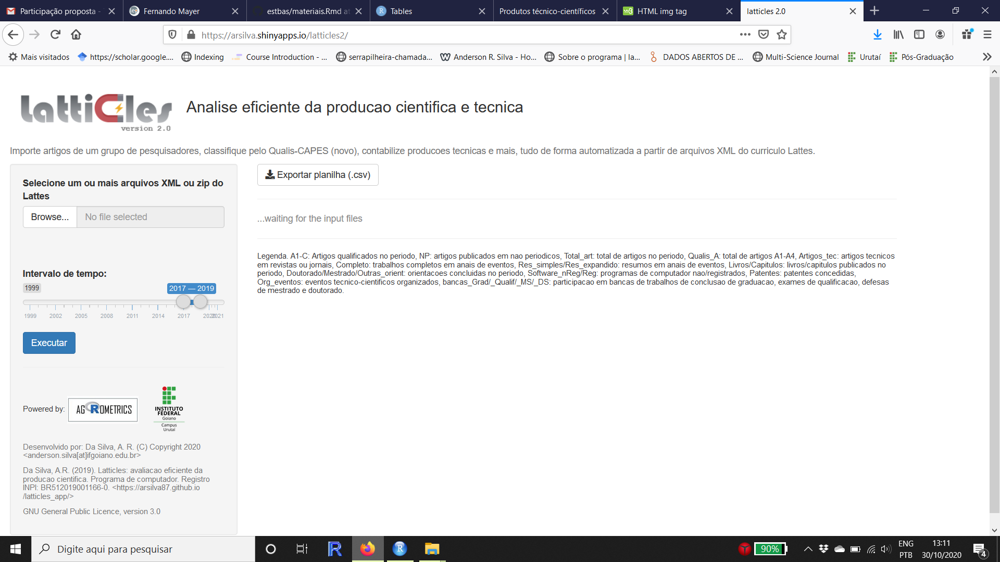
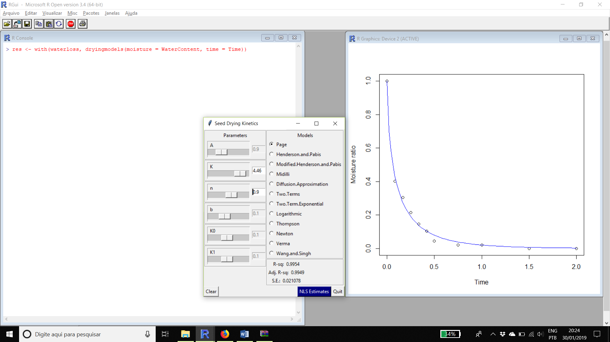
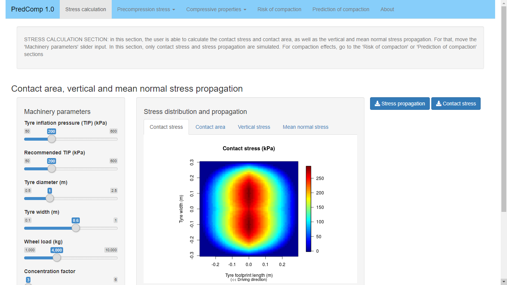
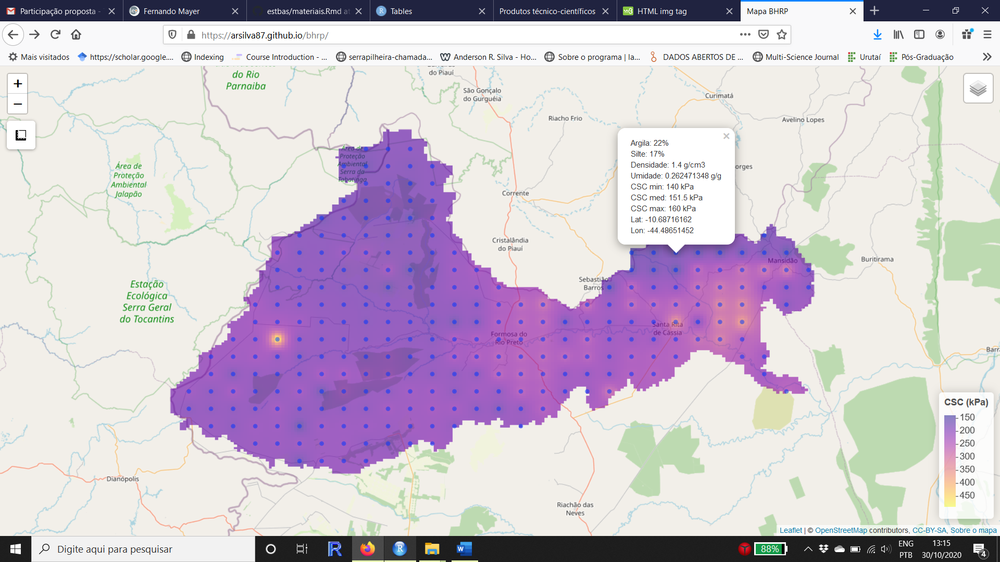

[biotools](https://cran.r-project.org/package=biotools) - _Tools for Biometry and Applied Statistics in Agricultural Science_. Pacote do software R.

[soilphysics](https://cran.r-project.org/package=soilphysics) - _Soil Physical Analysis_. Pacote do software R.

[Latticles](https://arsilva.shinyapps.io/latticles2/) - _Avaliação eficiente da produção científica_. Aplicativo web baseado no pacote R Shiny. Registro INPI: BR512019001166-0

[seedwater](https://appsoilphysics.shinyapps.io/PredComp/) - _Models for drying and soaking kinetics of seeds_. Pacote do software R. Registro INPI: BR512019000731-0

[PredComp 1.0](https://appsoilphysics.shinyapps.io/PredComp/) - _Predition of Soil Compaction Induced by Agricultural Field Traffic_. Aplicativo web baseado no pacote R Shiny. Registro INPI: BR512020001301-5

[BHRP](https://arsilva87.github.io/bhrp/) - _Mapa interativo da capacidade de suporte de carga dos solos da Bacia Hidrográfica do Rio Preto – BA_
